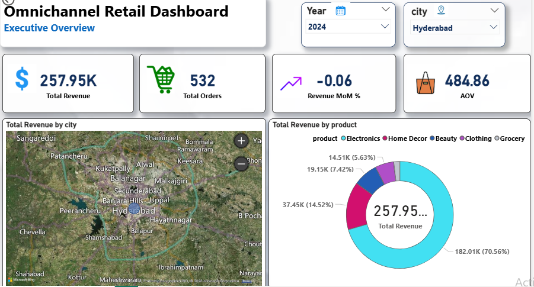
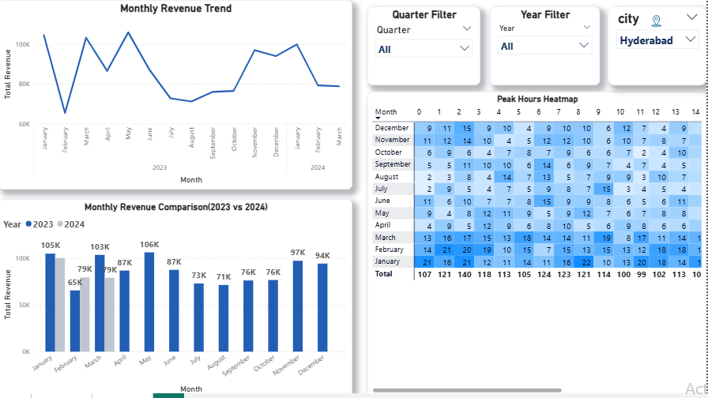
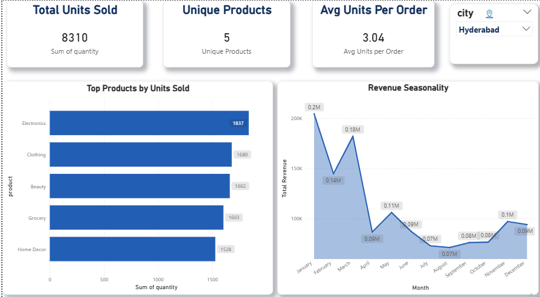

# Omnichannel Retail Sales and Inventory Analytics Dashboard

## 📊 Dashboard Preview

### Page 1 – Executive Summary Dashboard


### Page 2 – Sales Trend & Time Analysis


### Page 3 – Product Performance & Order Insights


---

## 📌 Project Overview

This project analyzes omnichannel retail sales data to uncover business insights across multiple dimensions such as time, product category, and geography.  

The objective is to help decision-makers:
- Understand revenue drivers  
- Identify customer buying patterns  
- Optimize sales strategy  

---

## ❗ Business Problem

Retail companies often lack visibility into:
- Which products contribute the most to revenue  
- When customers are most active  
- Which regions underperform  
- How order value varies across cities  

Without these insights, businesses struggle to optimize pricing, marketing, and inventory strategies.

---

## ⚙️ End-to-End Data Pipeline

This project follows a structured analytics pipeline:

### 🔹 1. Data Processing (Python)
- Cleaned raw CSV data
- Removed duplicates & handled missing values
- Standardized columns
- Integrated multiple data sources (online_sales.csv & pos_sales.csv) to create a consolidated omnichannel dataset
  
### 🔹 2. Data Storage (PostgreSQL)
- Stored cleaned data in relational tables  
- Enabled efficient querying using SQL  

### 🔹 3. Data Visualization (Power BI)
- Built interactive dashboards  
- Created DAX measures for KPIs:
  - Total Revenue  
  - Total Orders  
  - AOV (Average Order Value)  
  - MoM Growth  

---

## 📊 Dashboard Highlights

The Power BI dashboard provides:

- 📈 Revenue trends over time (monthly analysis)  
- 🛍️ Product category performance  
- 🌍 City-wise revenue distribution  
- ⏰ Peak order hour analysis  
- 📦 KPI summary cards  

---

## 🔍 Key Business Insights

- 📊 **Strong seasonal trend observed**  
  → Revenue peaks during Q4 (Nov–Dec), indicating holiday demand  

- 🛒 **Electronics is the top-performing category**  
  → Contributes the largest share of total revenue  

- ⏰ **Customer activity peaks in evening hours (6–9 PM)**  
  → Indicates post-work shopping behavior  

- 📉 **Chennai shows the lowest AOV**  
  → Customers are purchasing lower-value items  

---

## 🚀 Actionable Recommendations

| Observation | Insight | Recommendation |
|------------|--------|----------------|
| High Q4 sales | Seasonal demand spike | Launch early marketing campaigns in October |
| Peak evening orders | Customers shop after work | Optimize server & logistics capacity |
| Electronics dominates revenue | High-value products drive growth | Introduce bundle offers & cross-selling |
| Low AOV in Chennai | Smaller purchase size | Implement free shipping threshold |

---

## ⚙️ Setup Instructions

To run this project locally:

### 1. Clone the repository
```bash
git clone https://github.com/premprakash123/Omnichannel-Retail-Analytics.git
cd Omnichannel-Retail-Analytics

-2. Run Data Processing (Python)
Open notebooks folder
Run:
01_data_generation.ipynb
02_data_cleaning.ipynb
👉 This will generate the cleaned dataset (omnichannel_fixed.csv)

### 3. Load Data into PostgreSQL
- Create a PostgreSQL database (e.g., `retail_db`)
- Import the cleaned CSV (`omnichannel_fixed.csv`)
- Use pgAdmin or psql to load the data

---

### 4. Connect Power BI to PostgreSQL
- Open Power BI Desktop
- Click **Get Data → PostgreSQL**
- Enter:
  - Server: localhost
  - Database: retail_db

---

### 5. Open Dashboard
- Open the `.pbix` file
- Click **Refresh**

👉 Dashboard will load with processed data

## 📁 Project Structure
         
